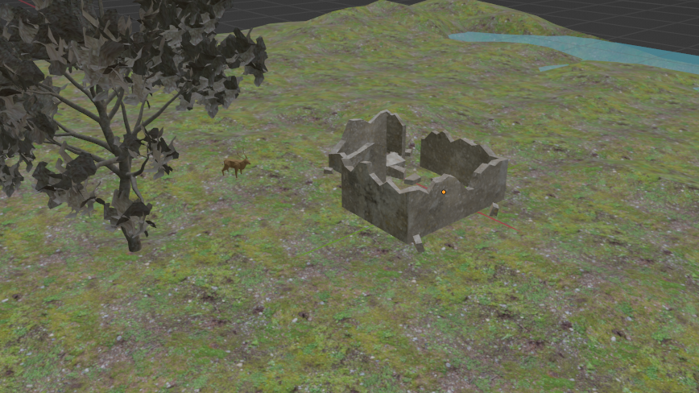
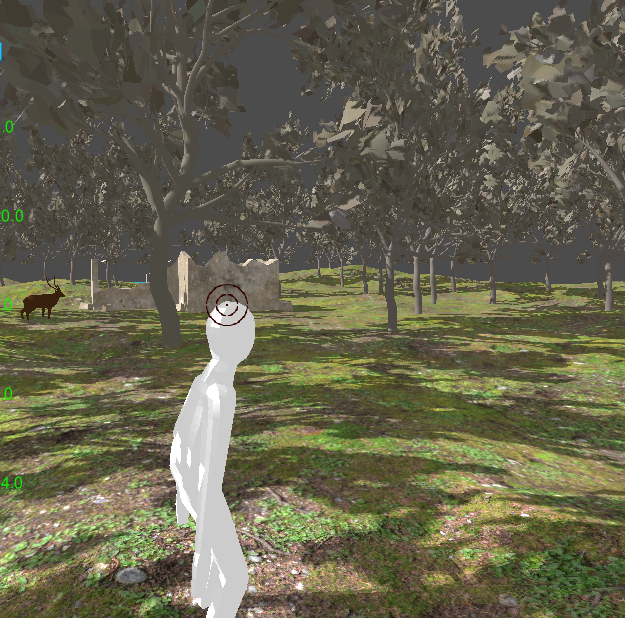
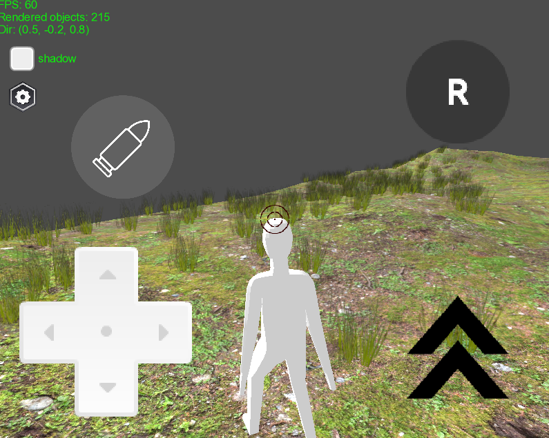
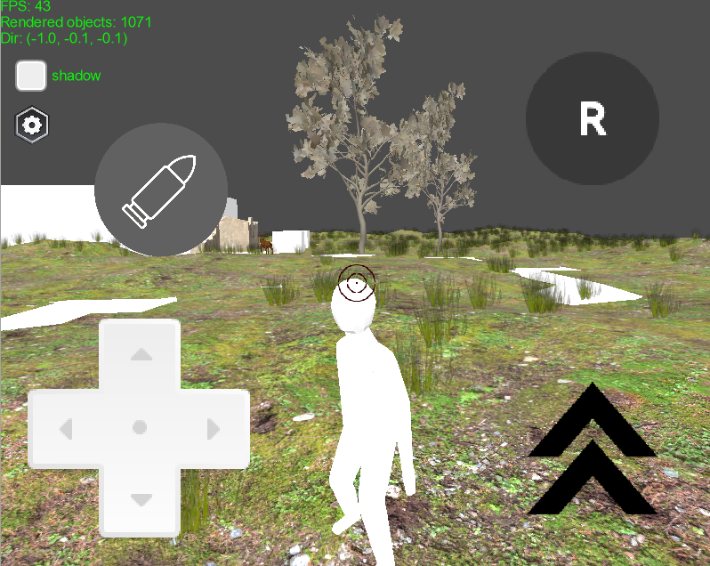
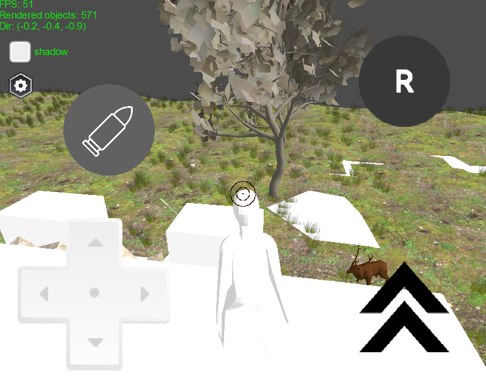
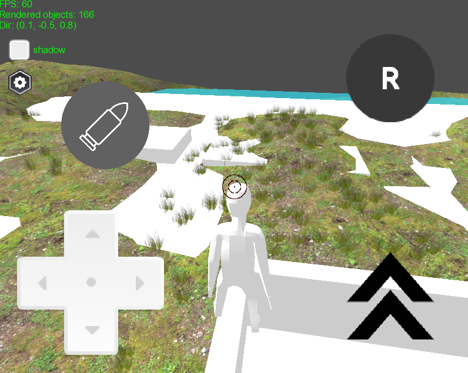

# libgdx-test

with grass

- movement using raycasting instead of rigid body (fast, and still using bullet physics)
- lagging and fast movement have been handled
- manual check of collision detection (using ray casting). not sure about this, but works fine. Maybe because the shape of the object is not complex
- Manual jump is easy to set, whether time base or frame base and the gravity factor

